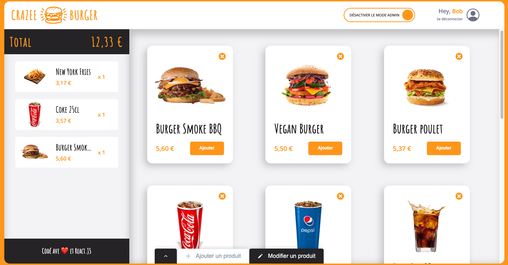
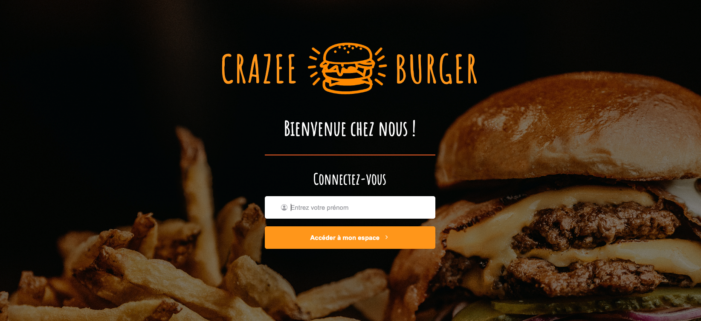
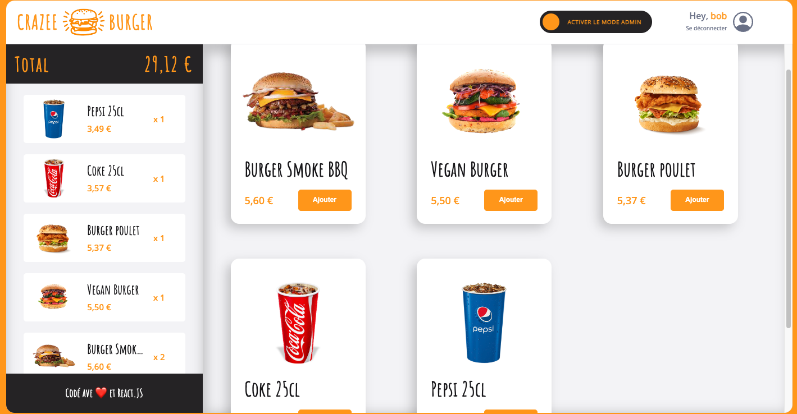
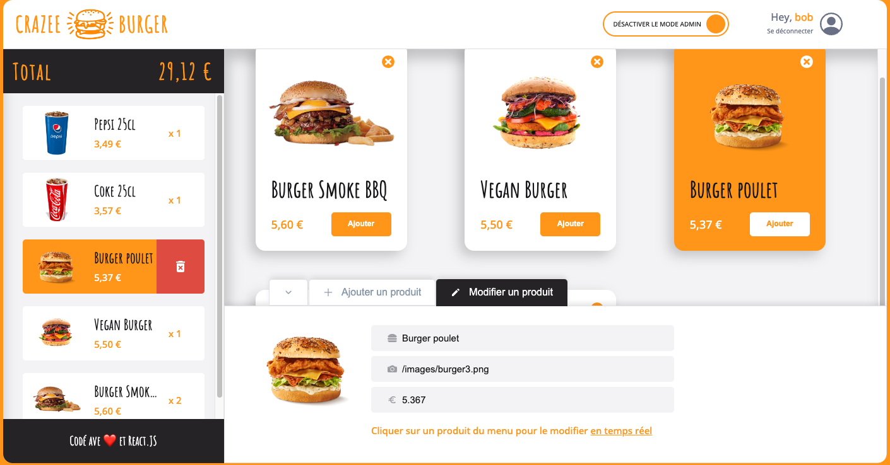

# Crazee Burger

An interactive e-commerce website written in React for ordering burgers and soda.

A live demo is available here : https://crazee-burger-orcin.vercel.app/

This project was developed as part of the [ViDev](https://videv.podia.com/react-comme-un-pro-formation) Front-End React Course.

## Description

### Landing Page

On the landing page, enter your name and click on the button "Accéder à mon espace".

### Menu Page

On the menu page, you can click on the "Ajouter" button of any card, wich will fill the basket with the total price displayed at the top of the basket. You can delete a product from the basket by clicking on the delete button when you hover over the basket card.

### Admin Mode

By clicking on the "Activer le mode admin" button, you will enter admin mode.

In admin mode you can :

- Add a new product by providing its name, image link, and price (in the "Ajouter un produit" tab).
- Edit a product by modifying its name, image link and price (in the "Modifier un produit" tab). If its exists, the corresponding item in the basket will be modified as well. Clicking on any card (in the menu or basket) will display the edit tab.

## Run Locally

1. If not already, install Node and NPM
2. Clone the git repository
3. Navigate to the directory
4. Install all packages and dependencies with `npm install`
5. Launch a local server using `npm run dev`
6. The application will be accessible at your default localhost address
